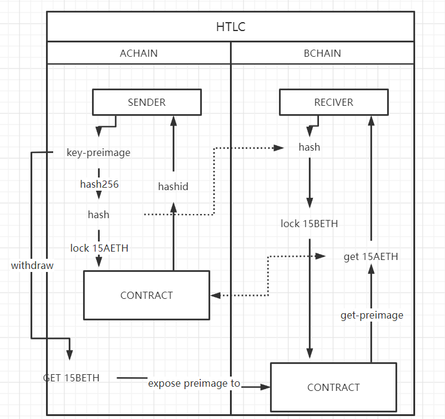
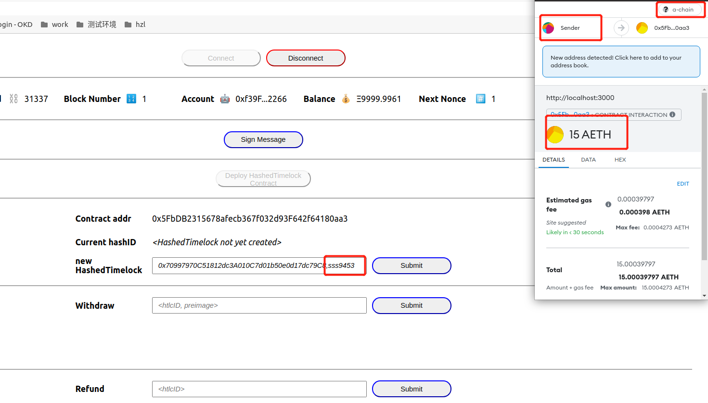
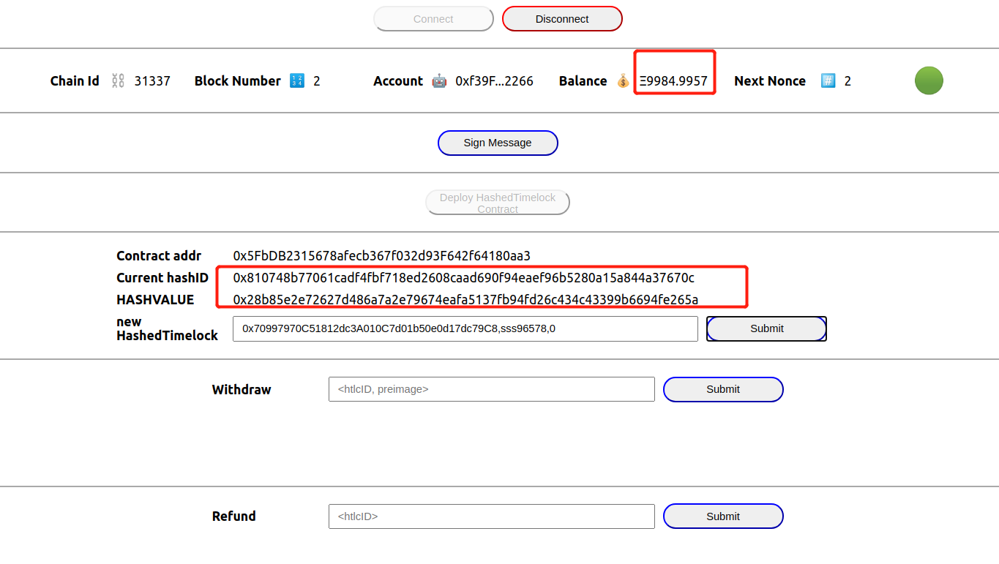
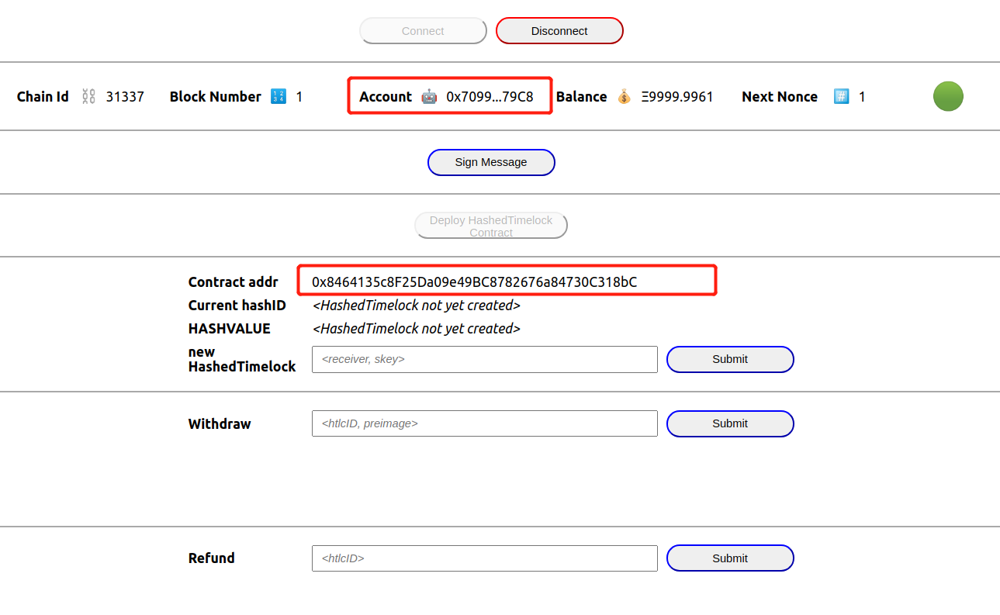
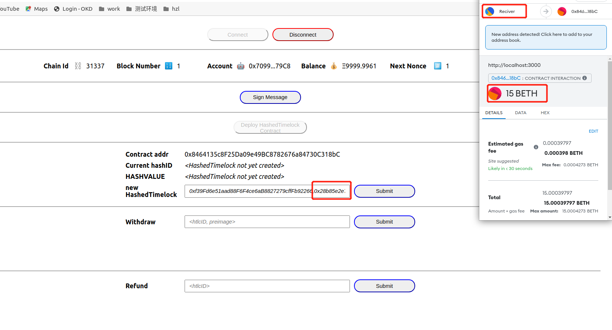
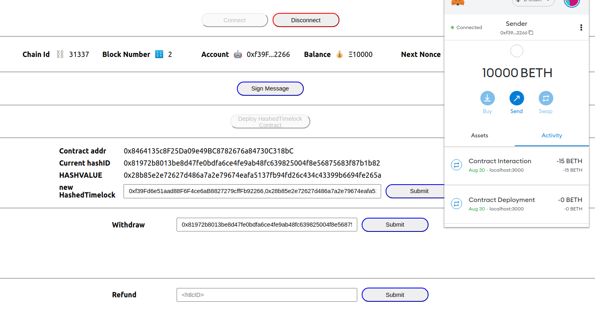
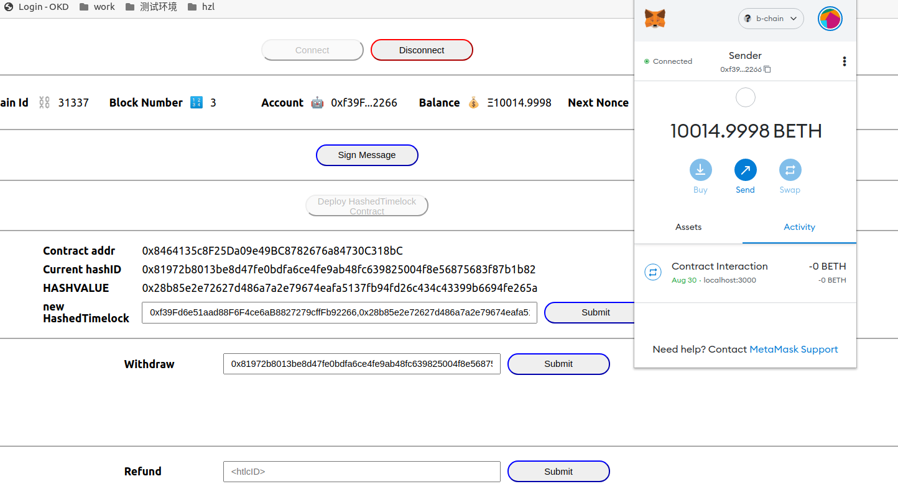

# htlc

## Project development technology

* contract: solidity + hardhat + js
* dapp: react + typescript

## Project scheme



## Project setup
```
npm install
```

## contract

##compiling your contracts
```
npx hardhat compile
```

### deploy

```
ywd@ubuntu:~/workspace/vue3/htlc$ npx hardhat run scripts/deploy.js
Lock deployed to 0x5FbDB2315678afecb367f032d93F642f64180aa3

```

### test
```
ywd@ubuntu:~/workspace/vue3/htlc$ npx hardhat test


  HTLC
    Deployment
      ✔ Should set the right unlockTime (1397ms)
    HashedTimeLock
      newHTLC() test
        ✔ Should create newHTLC (130ms)
        ✔ Should return error when create newHTLC with incorrect args (57ms)
        ✔ Should return error when create newHTLC with timelocks in the past (39ms)
        ✔ Should return error when create newHTLC with same preimage (104ms)
      withdraw() test
        ✔ Should success to extract the locked asset (121ms)
        ✔ Should return error when hashlock hash does not match (63ms)
        ✔ Should return error when already withdrawn (88ms)
        ✔ Should return error when timeout (3054ms)
      refund() test
        ✔ Should sender calls this method to retrieve the locked asset (3085ms)
        ✔ Should return error when already refunded (3087ms)
        ✔ Should return error when already withdrawn (5088ms)
        ✔ Should return error when timelock not yet passed (2052ms)


  13 passing (18s)

```

## Getting started


### step 1. start A and B blockchain


```
# a blockchain
npx hardhat node --port 8545
```

```
# b blockchain
npx hardhat node --port 9545
```

### step 2. install metamask

connet two blockchain

- now
- a-chain sender 10000AETH && reciver 10000AETH
- b-chain sender 10000BETH && reciver 10000BETH

### step 3. sender deploy contract on Achain and lock 15AETH






- get output
```
1. hashId: 0x810748b77061cadf4fbf718ed2608caad690f94eaef96b5280a15a844a37670c
2. key-hash: 0x28b85e2e72627d486a7a2e79674eafa5137fb94fd26c434c43399b6694fe265a
```

### step 4. reciver deploy contract on Bchain and use sender key-hash lock 15BETH





### step 5. sender connect BCHAIN and use key(sss96578) to withdraw reciver's BETH




### step 6. sender get 15BETH, reciver get the hashkey preimage at the same time, so reciver can use this get 15AEHT at ACHAIN